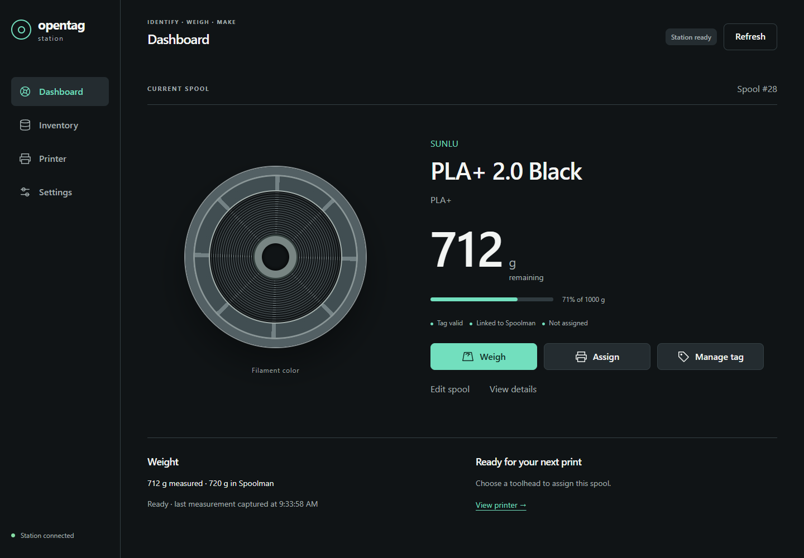
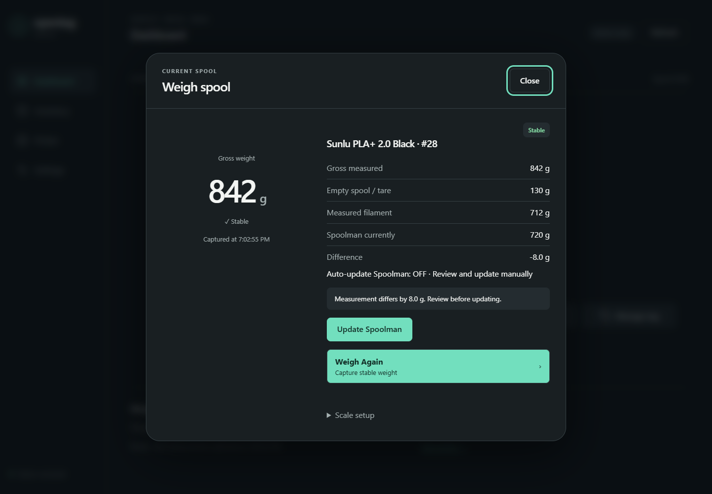
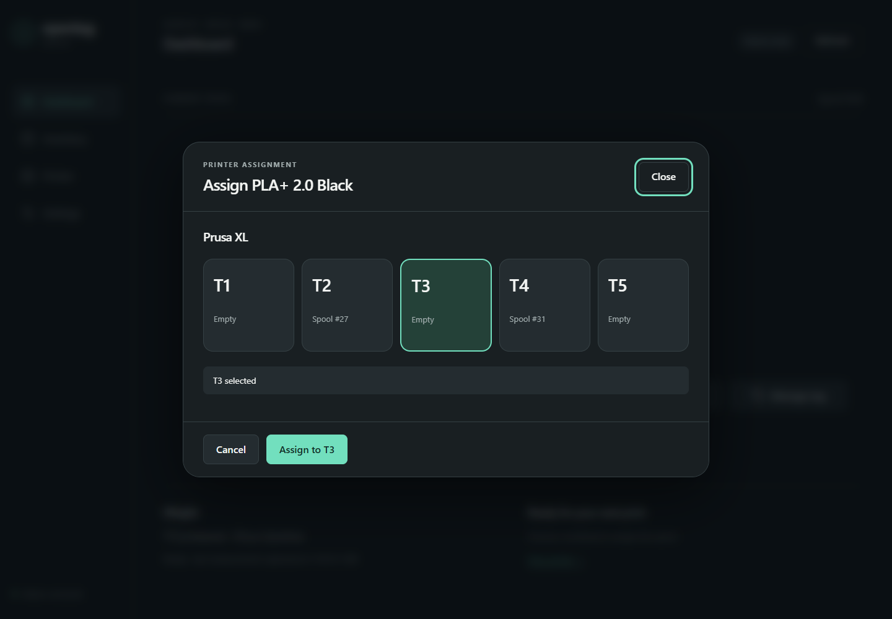
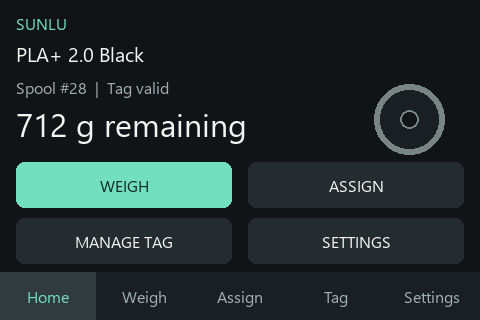

<h1 align="center">OpenTag Station</h1>

<p align="center">
  A touchscreen and local browser companion for filament spools.<br>
  Identify with OpenPrintTag, weigh, manage inventory in Spoolman,<br>
  and assign to a Prusa XL toolhead through FilaBridge.
</p>

<p align="center">
  <a href="https://76cb.github.io/OpenTag-Station/"></a>
  <a href="https://76cb.github.io/OpenTag-Station-Docs/"></a>
  <a href="https://github.com/76cb/OpenTag-Station"></a>
</p>

<p align="center">
  <a href="https://github.com/76cb/OpenTag-Station/actions/workflows/ci.yml"></a>
  <a href="VERSION"></a>
  <a href="LICENSE.md"></a>
  <a href="https://github.com/76cb/OpenTag-Station/commits/main/"></a>
</p>

> **1.0 release candidate:** external browser review, WT32 visual/touch inspection,
> and final physical/live-service acceptance remain pending. See the
> [release checklist](docs/releasing.md). [VERSION](VERSION) is authoritative.

<p align="center">
  
</p>

## What it does

**Place spool → identify → weigh → update inventory → assign → verify**

- Identify NFC-V OpenPrintTag spools.
- Weigh filament and reconcile it against canonical Spoolman inventory.
- Import Community filament definitions.
- Write, update and clear tags with verification.
- Assign spools to Prusa XL T1–T5 through FilaBridge.
- Use the local browser interface or WT32 touchscreen.

---

## In use

<p align="center">
  
  
</p>

<p align="center">
  
  
</p>

Screenshots use sanitized, generic deterministic demo data. The WT32 fixture
approximates production layout and fonts; it is not a physical panel capture.

## Feature highlights

### Spool identification

Bring the current spool into focus with OpenPrintTag identification, a searchable
inventory and Community filament import. See [identifying a spool](https://76cb.github.io/OpenTag-Station-Docs/daily-use/identify/).

### Weighing and inventory

Weigh receipts separate gross weight, empty-spool tare, measured filament and
canonical remaining weight. Edit inventory in Spoolman; auto-update after Weigh
is off by default. See [weighing](https://76cb.github.io/OpenTag-Station-Docs/daily-use/weigh/).

### Tag management

Guarded write/update actions use full readback and recovery journaling. Clear /
Reuse verifies Spoolman identity cleanup. See [managing tags](https://76cb.github.io/OpenTag-Station-Docs/daily-use/manage-tags/).

### Printer assignment

Assign to T1–T5 through FilaBridge with replacement confirmation and exact backend
readback. See [Prusa XL assignment](https://76cb.github.io/OpenTag-Station-Docs/printer/prusa-xl/).

### Browser + touchscreen

Use a responsive local dashboard or WT32 Home, Weigh, Assign, Tag and Settings
views with large touch actions. Wi-Fi setup, an optional local API token, redacted
configuration backup and local A/B OTA support everyday maintenance.
The interface uses HTTP on a trusted LAN; firmware images are not publisher-signed.
See [configuration and security](https://76cb.github.io/OpenTag-Station-Docs/configuration/security/).

---

## Quick start

1. Assemble and inspect the supported hardware using the [wiring guide](https://76cb.github.io/OpenTag-Station-Docs/hardware/wiring/).
2. Connect a data-capable USB cable and open the [web flasher](https://76cb.github.io/OpenTag-Station/) in desktop Chrome or Edge.
3. Install **OpenTag Station**, join its setup network, and [configure Wi-Fi, Spoolman and optional FilaBridge](https://76cb.github.io/OpenTag-Station-Docs/getting-started/initial-setup/).
4. Select the matching scale profile, then [tare and calibrate the platform](https://76cb.github.io/OpenTag-Station-Docs/scale/calibration/).
5. Place a spool and use the Dashboard, following the [first-spool guide](https://76cb.github.io/OpenTag-Station-Docs/getting-started/quick-start/).

The public installer tracks firmware main. USB recovery can erase configuration
and calibration; normal OTA takes an application binary, not a factory image.

---

## Hardware

| Part | Supported configuration |
|---|---|
| Controller | WT32-SC01 Plus / ESP32-S3, 16 MiB flash, 480 × 320 touchscreen |
| Scale ADC | NAU7802 |
| Load cell | YZC-133 5 kg (default) or 2 kg with matching calibration |
| NFC reader | ELECHOUSE NFC_ST25R3916B, I²C bridge closed, integrated antenna |
| Tags | NXP ICODE SLIX2 NFC-V / ISO15693, 80 × 4-byte approved profile |
| Power | Regulated 5 V with qualified breakout/harness |

```text
WT32-SC01 Plus
├─ Wire  / controller 0: GPIO10 SDA, GPIO11 SCL → NAU7802 (0x2A, 400 kHz)
├─ Wire1 / controller 1: GPIO13 SDA, GPIO14 SCL → NFC (0x50, 100 kHz), IRQ GPIO12
└─ Software I²C: GPIO6 SDA, GPIO5 SCL → built-in touch
```

NFC uses EXT 5 V/common ground; CS/BSS and MOSI remain disconnected. GPIO is
3.3 V logic. Check the scale breakout's supply and pull-up ratings before wiring.
Use a rigid, free-moving platform; no reference enclosure is defined.

**Hardware guides:** [BOM](https://76cb.github.io/OpenTag-Station-Docs/hardware/bill-of-materials/) ·
[Complete wiring and connector orientation](https://76cb.github.io/OpenTag-Station-Docs/hardware/wiring/) ·
[Pinout](https://76cb.github.io/OpenTag-Station-Docs/hardware/pinout/) ·
[Power](https://76cb.github.io/OpenTag-Station-Docs/hardware/power/) ·
[Mechanical setup](https://76cb.github.io/OpenTag-Station-Docs/hardware/mechanical/)

---

## Documentation

**[Read the OpenTag Station manual →](https://76cb.github.io/OpenTag-Station-Docs/)**

- [Getting started](https://76cb.github.io/OpenTag-Station-Docs/getting-started/overview/) — installation, setup and your first spool.
- [Hardware & wiring](https://76cb.github.io/OpenTag-Station-Docs/hardware/wiring/) — components, connectors and assembly.
- [Daily use](https://76cb.github.io/OpenTag-Station-Docs/daily-use/identify/) — identify, weigh, update, assign and manage tags.
- [OpenPrintTag](https://76cb.github.io/OpenTag-Station-Docs/openprinttag/overview/) — supported tags, writing and recovery.
- [Spoolman](https://76cb.github.io/OpenTag-Station-Docs/inventory/spoolman/) — canonical inventory and integration.
- [FilaBridge](https://76cb.github.io/OpenTag-Station-Docs/printer/prusa-xl/) — Prusa XL assignment and replacement.
- [Troubleshooting](https://76cb.github.io/OpenTag-Station-Docs/troubleshooting/) — diagnosis and recovery.
- [Advanced](https://76cb.github.io/OpenTag-Station-Docs/advanced/architecture/) / [API](https://76cb.github.io/OpenTag-Station-Docs/reference/api/) — architecture and local endpoints.
- [Release process](https://76cb.github.io/OpenTag-Station-Docs/contributing/release/) — packaging, checks and acceptance.

The separate documentation project is maintained in [documentation-site](documentation-site/README.md)
and exported to its own repository. Firmware Pages remains the installer.

---

## Build and develop

The production environment is **`wt32-sc01-plus`**.

```sh
python -m venv .venv
# Activate the environment for your shell.
python -m pip install -r requirements-dev.txt
python tools/release_version.py
pio test --environment native
pio run --environment wt32-sc01-plus
pio run --environment wt32-sc01-plus --target web-flasher
```

PlatformIO and embedded dependencies are pinned. Linux/WSL matches CI for native
and sanitizer checks. VERSION drives firmware metadata, About/browser build info,
flasher manifests and exported documentation. CI checks source/ELF ownership,
memory, stack reserves, browser behavior, public-image privacy and documentation.

See [building from source](https://76cb.github.io/OpenTag-Station-Docs/contributing/build/),
[testing](https://76cb.github.io/OpenTag-Station-Docs/contributing/testing/) and
[contributing](https://76cb.github.io/OpenTag-Station-Docs/contributing/pull-requests/).

## Project status

- **Firmware CI:** live main-branch status is shown in the badge above.
- **Web flasher:** production-only installer deployed.
- **Browser and WT32 interfaces:** 1.0 release candidate.
- **Documentation:** live in the separate manual.
- **Final acceptance:** external browser review, WT32 visual/touch inspection and
  physical/live-service acceptance pending; no final v1.0.0 release is published.

---

## License

[PolyForm Noncommercial License 1.0.0](LICENSE.md) permits noncommercial use and
distribution; it is not an OSI-approved open-source license. Vendored ELECHOUSE
libraries retain their included licenses; see [third-party notices](third_party/ELECHOUSE_ST25R3916/README.md).
