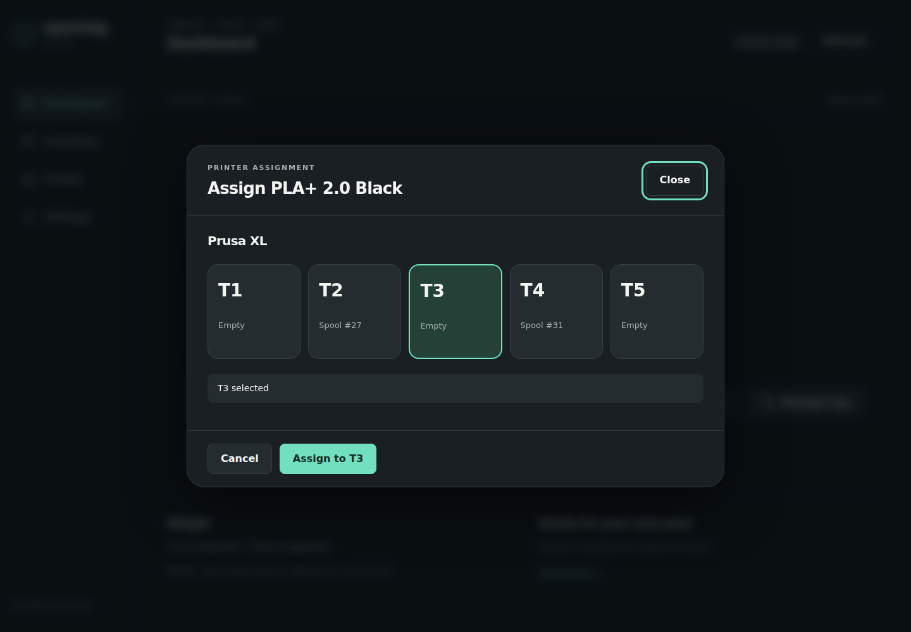

<h1 align="center">OpenTag Station</h1>

<p align="center">
  A touchscreen station for your filament spools.<br>
  Put a spool on it: it reads the NFC tag, weighs the spool and keeps Spoolman up to date.
</p>

<p align="center">
  <a href="https://76cb.github.io/OpenTag-Station-Docs/"></a>
  <a href="https://76cb.github.io/OpenTag-Station/"></a>
  <a href="https://github.com/76cb/OpenTag-Station/releases"></a>
</p>

<p align="center">
  <a href="https://github.com/76cb/OpenTag-Station/actions/workflows/ci.yml"></a>
  <a href="VERSION"></a>
  <a href="LICENSE.md"></a>
</p>

<p align="center">
  
</p>

## What it does

OpenTag Station is a device you build yourself from a WT32-SC01 Plus touchscreen board, an NFC
reader and a load cell. It works with your own [Spoolman](https://github.com/Donkie/Spoolman)
server, which stays the record of what you own.

- **Identify a spool.** Place a tagged spool on the station and it shows which Spoolman spool it is.
- **Write tags.** Pick a spool or filament from Spoolman and the station writes a blank tag in the
  [OpenPrintTag](https://github.com/OpenPrintTag/openprinttag-specification) format, checks it, and links it to the spool.
- **Weigh and save.** It subtracts the empty spool and shows the filament left. Nothing changes in
  Spoolman until you press **UPDATE SPOOLMAN** (automatic saving is optional and off by default).
- **Clear and reuse tags.** Erase a tag and remove its link in Spoolman in one step.
- **Assign a toolhead** (optional). With [FilaBridge](https://github.com/sargonas/filabridge) and a
  Prusa XL, tell the printer which spool is in T1–T5.

Everything works from the touchscreen. The same station also serves a web page on your network for
settings, inventory browsing and firmware updates.

<p align="center">
  
  
</p>
<p align="center">
  
  
</p>

<sub>The pictures are generated from demo data. The touchscreen picture is a rendering, not a photo.</sub>

## What you need

| | |
|---|---|
| Controller | WT32-SC01 Plus (ESP32-S3, 16 MB flash, 480 × 320 touchscreen) |
| Scale | NAU7802 breakout and one YZC-133 load cell, 5 kg (default) or 2 kg |
| NFC reader | ELECHOUSE NFC_ST25R3916B module, switched to I2C mode |
| Tags | Blank NXP ICODE SLIX2 (NFC-V / ISO 15693). NTAG and MIFARE tags are not detected. |
| Power | Regulated 5 V over USB |
| On your network | A running Spoolman server and 2.4 GHz Wi-Fi |
| Optional | FilaBridge and a Prusa XL, for toolhead assignment |

There is no reference enclosure; you design the scale platform yourself. Details are in the
[parts list](https://76cb.github.io/OpenTag-Station-Docs/hardware/bill-of-materials/).

## Get started

1. **Build it.** Follow the [parts list](https://76cb.github.io/OpenTag-Station-Docs/hardware/bill-of-materials/)
   and the [wiring guide](https://76cb.github.io/OpenTag-Station-Docs/hardware/wiring/).
2. **Install the firmware.** Connect the board with a USB data cable and open the
   [USB installer](https://76cb.github.io/OpenTag-Station/) in desktop Chrome or Edge
   ([guide](https://76cb.github.io/OpenTag-Station-Docs/installation/web-flasher/)).
   A USB install erases all settings and the scale calibration. Until the first release, the
   installer offers an older candidate; see [Project status](#project-status).
3. **Join your Wi-Fi.** The touchscreen shows a setup network named `OpenTag-Setup-XXXX` and its
   password. Enter your Wi-Fi on the touchscreen, or join that network and open
   `http://192.168.4.1/` ([guide](https://76cb.github.io/OpenTag-Station-Docs/getting-started/first-boot/)).
   Afterwards the station is at `http://opentag-station.local/`.
4. **Prepare Spoolman.** Add two extra fields of type **Text** to the **Spool** entity, with the
   keys `opentag_instance_uuid` and `nfc_uid`
   ([why and how](https://76cb.github.io/OpenTag-Station-Docs/inventory/custom-fields/)). Without them
   the station cannot link a tag to a spool.
5. **Connect and calibrate.** Enter the Spoolman address (and FilaBridge, if you use it), then
   [tare and calibrate the scale](https://76cb.github.io/OpenTag-Station-Docs/scale/calibration/)
   ([guide](https://76cb.github.io/OpenTag-Station-Docs/getting-started/initial-setup/)).
6. **Write your first tag.** [Your first spool](https://76cb.github.io/OpenTag-Station-Docs/getting-started/quick-start/)
   walks through writing a tag, saving a weight and assigning a toolhead.

Once a release is published, later firmware updates are done from the station's web page with the
file `opentag-station-<version>-application.bin` from the
[Releases](https://github.com/76cb/OpenTag-Station/releases) page, and keep your settings
([guide](https://76cb.github.io/OpenTag-Station-Docs/installation/ota/)).

## Documentation

**[Read the manual →](https://76cb.github.io/OpenTag-Station-Docs/)**

| If you want to… | Read |
|---|---|
| See what it does and what to buy | [What the station does and what you need](https://76cb.github.io/OpenTag-Station-Docs/getting-started/overview/) |
| Wire it | [Wiring](https://76cb.github.io/OpenTag-Station-Docs/hardware/wiring/) |
| Use it day to day | [Identify](https://76cb.github.io/OpenTag-Station-Docs/daily-use/identify/) · [Weigh](https://76cb.github.io/OpenTag-Station-Docs/daily-use/weigh/) · [Write a tag](https://76cb.github.io/OpenTag-Station-Docs/daily-use/manage-tags/) · [Clear a tag](https://76cb.github.io/OpenTag-Station-Docs/daily-use/clear-reuse/) · [Assign a toolhead](https://76cb.github.io/OpenTag-Station-Docs/daily-use/assign/) |
| Know which tags to buy | [Which tags work](https://76cb.github.io/OpenTag-Station-Docs/openprinttag/supported-tags/) |
| Fix a problem | [Troubleshooting](https://76cb.github.io/OpenTag-Station-Docs/troubleshooting/) |
| Keep it safe on your network | [Access token and network safety](https://76cb.github.io/OpenTag-Station-Docs/configuration/security/) |
| Script it | [REST API](https://76cb.github.io/OpenTag-Station-Docs/reference/api/) · [Configuration keys](https://76cb.github.io/OpenTag-Station-Docs/reference/configuration/) |
| Check compatibility | [Supported versions](https://76cb.github.io/OpenTag-Station-Docs/reference/upstream/) |

The manual's source is in [`documentation-site/`](documentation-site/README.md). Notes for people
working on the firmware are in [`docs/`](docs/README.md).

## Good to know

- The station talks plain HTTP and is meant for a home network you trust. Do not expose it to the
  internet. Set an access token so that only you can change it from a browser.
- Firmware files are not signed by the publisher.
- Saving weights and assigning toolheads are enabled only for the Spoolman and FilaBridge versions
  the firmware was tested with; see
  [Supported versions](https://76cb.github.io/OpenTag-Station-Docs/reference/upstream/).

## Project status

Release candidate; [`VERSION`](VERSION) holds the version on `main` and the
[changelog](CHANGELOG.md) lists what changed. No release has been published yet, so the Releases
page has no update file and the USB installer still offers an earlier candidate. Until then,
build the firmware from source (below). What remains before 1.0 is listed in
[`docs/releasing.md`](docs/releasing.md).

## Build from source

```sh
python -m venv .venv
. .venv/bin/activate
python -m pip install --requirement requirements-dev.txt
pio test --environment native                              # host tests
pio run --environment wt32-sc01-plus                       # firmware
pio run --environment wt32-sc01-plus --target upload       # flash over USB
```

PlatformIO and all libraries are pinned. A change to the firmware needs a version bump
(`python tools/bump_version.py <new-version>`), which CI checks, and a changelog entry, which you
write by hand. See
[Build from source](https://76cb.github.io/OpenTag-Station-Docs/contributing/build/),
[Testing and CI](https://76cb.github.io/OpenTag-Station-Docs/contributing/testing/) and
[Contributing changes](https://76cb.github.io/OpenTag-Station-Docs/contributing/pull-requests/).

## License

[PolyForm Noncommercial License 1.0.0](LICENSE.md): free to use, change and share for noncommercial
purposes. It is not an OSI-approved open-source license. The vendored ELECHOUSE NFC libraries keep
their own licenses; see the [third-party notices](third_party/ELECHOUSE_ST25R3916/README.md).
