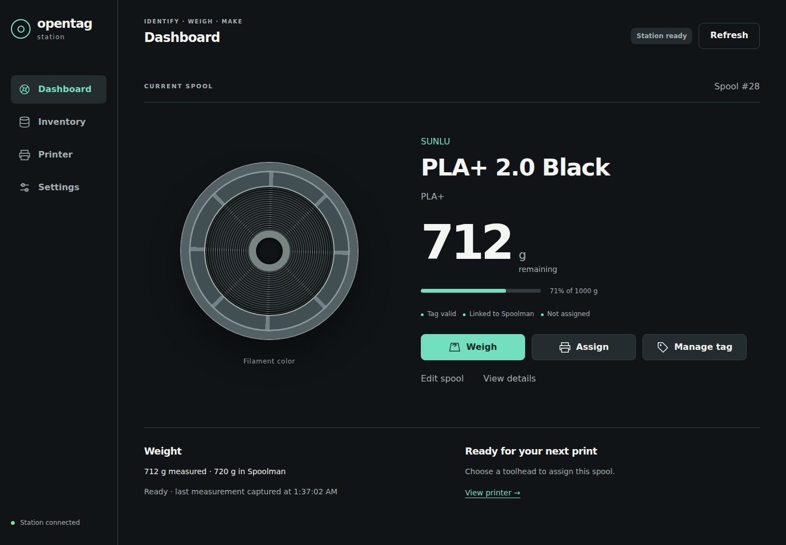

# Identify a spool

Put a tagged spool on the station and it tells you which spool it is and how much filament
Spoolman thinks is left. This page explains what each screen means and what to do next.

## Steps

1. Put one spool on the station with its tag over the reader. Keep other tags away from the reader.
2. Wait a second or two. The station reads the tag, then looks the spool up in Spoolman.
3. Read the result on the touchscreen **Home** page or the browser **Dashboard** page.

The reader starts once the station has joined your Wi-Fi.
Right after first setup it also waits until the setup network has closed, about 30 seconds.
Until then tags are ignored; see [Tag is not detected](../troubleshooting/tag.md).

## What you see and what it means

| Situation | Touchscreen (Home) | Browser (Dashboard) | What to do next |
|---|---|---|---|
| Nothing on the reader | "OpenTag Station", "Place a spool", "Set a tagged spool on the station" | "Place a spool", with **Write a new tag** and **Browse inventory** | Place a spool. |
| Tag linked to a Spoolman spool | Maker, filament name, "Spool #N" and "NNN g remaining" (or "Weight not known") | "CURRENT SPOOL", "Spool #N", name, "N g remaining", "N% of M g", and the labels "Tag valid", "Linked to Spoolman" and "Not assigned" or the printer and toolhead | [Weigh it](weigh.md), [assign it to a toolhead](assign.md) or [manage the tag](manage-tags.md). |
| Station is looking the spool up | "Finding this spool in Spoolman..." | "Looking up spool…" | Wait. |
| Tag has filament data but no Spoolman spool is linked | "Not linked yet: Manage tag > Link to a spool" | "Not yet linked", "Not linked to Spoolman" | Link it. See [below](#link-a-tag-the-station-does-not-recognise). |
| Spoolman cannot be reached | "Spoolman unavailable; spool not looked up" | "Spoolman resolution failed. Check the backend connection, then reinsert the spool or confirm its ID." | Fix the connection ([Spoolman problems](../troubleshooting/spoolman.md)), then lift the spool and put it back. |
| Blank tag | "COMPATIBLE BLANK TAG", "Ready to assign", "Open Manage tag to choose a spool". The first button reads **ASSIGN TAG**. | "Blank tag", "Ready to assign". The first button reads **Assign tag**. | [Write the tag](manage-tags.md). |
| Tag the station cannot use | On the **Tag** page: "This tag can't be used as it is", a reason, and "Use a blank NXP ICODE SLIX2 tag." | Dashboard: "Reading spool…" and "Tag needs attention". In **Manage tag**: "Unsupported" and "OpenPrintTag decode failed / unsupported" | Use a blank NXP ICODE SLIX2 tag. See [Which tags work](../openprinttag/supported-tags.md). |
| Two or more tags on the reader | Home keeps showing "Place a spool". The **Tag** page shows "Reading tag..." and does not finish. | In **Manage tag**: "Multiple NFC-V tags detected" and "Remove extra tags and present exactly one tag." | Leave one tag on the reader. |

Other kinds of NFC tag (for example NTAG or MIFARE) are not seen at all.
The screen keeps showing "Place a spool".

*Demo data.*

## Buttons on the main page

| Touchscreen | Browser | What it does |
|---|---|---|
| **WEIGH** | **Weigh** | Weighs the spool. See [Weigh a spool and save the weight](weigh.md). On the touchscreen this button reads **CALIBRATE** until the scale is calibrated. |
| **ASSIGN** | **Assign** | Puts the spool on a printer toolhead. See [Assign a spool to a toolhead](assign.md). |
| **MANAGE TAG** | **Manage tag** | Writes, updates, moves or erases the tag. See [Write or update a tag](manage-tags.md). |
| **SETTINGS** | **Settings** (left rail) | Opens the settings. |
| — | **Edit spool** | Opens the spool's Spoolman record for editing. See [Find and edit spools and filaments](../inventory/filaments-spools.md). |
| — | **View details** | Opens the **Manage tag** dialog, which also shows the tag's UID. |

## Link a tag the station does not recognise

A tag can hold valid filament data without Spoolman knowing which spool it belongs to,
for example a tag written by another station.
The station never creates a spool on its own for such a tag. You choose the spool.

**Touchscreen**

1. Tap **MANAGE TAG**.
2. If the station found likely matches, it says "This may be one of your Spoolman spools."
   Tap **CHOOSE WHICH SPOOL** and pick the right one under "Which spool is this?".
   Up to three choices are shown. With more, the screen says "More matches: choose in the browser."
3. Otherwise tap **LINK TO A SPOOL** and pick the spool as described in
   [Write or update a tag](manage-tags.md).

**Browser**

1. Under the spool card, read the hint. It is one of:
    - "More than one Spoolman spool matches this tag. Choose the spool on the station, then confirm."
    - "No Spoolman spool matched. Enter its Spoolman ID to confirm a local mapping."
2. Click one of the suggested spools, or type the spool's number into
   **Confirm the Spoolman spool on this station**.
3. Click **Confirm spool**.

Compare the suggestions with the physical spool in your hand.
A similar name is not enough when you own several spools of the same filament.

## If something goes wrong

| What you see | What it means | What to do |
|---|---|---|
| The screen stays on "Place a spool" with a tag on the reader | The tag is not an NFC-V tag, is too far from the reader, or the reader has not started yet | See [Tag is not detected](../troubleshooting/tag.md). |
| "This tag can't be used as it is" | The tag holds data that is neither blank nor OpenPrintTag | Use a blank NXP ICODE SLIX2 tag. The station does not erase unknown data. |
| "Spoolman unavailable; spool not looked up" | The station could not reach Spoolman | See [Spoolman problems](../troubleshooting/spoolman.md). |
