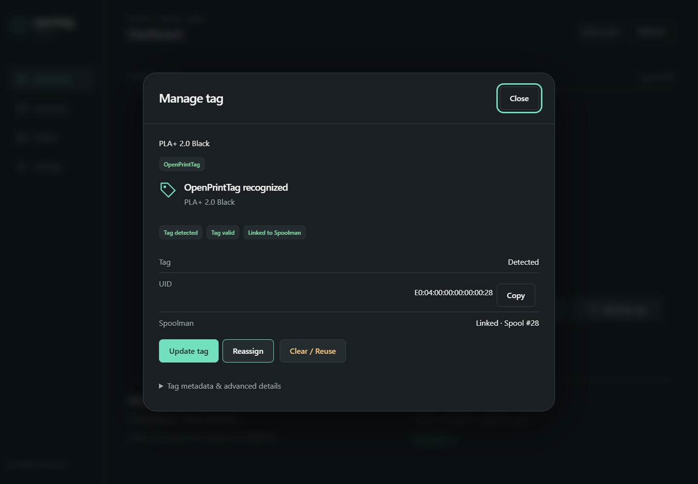

# Manage a tag

Inspect and update a current tag without losing track of the associated physical spool.

## Before you start

One stable approved tag and, for an update, a canonical Spoolman spool. Clear / Reuse is a separate operation with its own confirmation.

## Steps

1. Open **Manage tag** on Home or **Tag** on the touchscreen.
2. Inspect recognized format, material, link state and tag identity. Compare the spool number to the item in hand.
3. Choose **Update tag** to open a fresh canonical preview. Review proposed fields, changed blocks and warnings.
4. Confirm only the displayed tag and keep it present until verification completes. A preview does not itself write.
5. Choose **Reassign** to move an existing tag directly to another spool, review From/To, then review the writer preview. Clearing first is unnecessary.
6. For a compatible blank tag, choose **Assign tag**, then **My Spools**, **My Filaments**, or **Community**. My Filaments and Community continue through physical spool creation on the touchscreen.
7. After [Clear / Reuse](clear-reuse.md), choose an existing spool or create one immediately. Finish any pending cleanup with Retry Cleanup; no tag rewrite or reinsertion is needed.

## Expected result

The tag panel shows a verified result for the same tag, with the intended canonical spool association. Raw block editing is not exposed by the product UI.

## If it fails

A changed UID/generation/checksum, protected block or incomplete read refuses writing. A pending journal must be resolved with its original tag; a different tag cannot replace it. Do not confuse physical tag verification with completed remote association.

