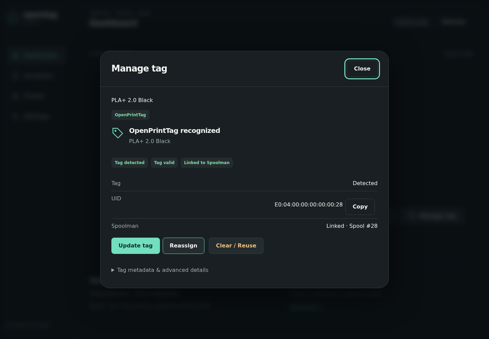

# Write or update a tag

Write a Spoolman spool's data onto a tag, refresh a tag after you changed the spool in Spoolman,
or move a tag to a different spool. Every write is checked: the station reads the tag again after
writing and only then saves the link in Spoolman.

## Before you start

- Spoolman is connected and has the two [required extra fields](../inventory/custom-fields.md).
- You have a blank NXP ICODE SLIX2 tag, or a tag the station wrote before.
  See [Which tags work](../openprinttag/supported-tags.md).
- Exactly one tag is on the reader, and it stays there until the station says it is done.

## What Manage tag offers

Touchscreen: tap **MANAGE TAG** on Home or **Tag** in the bottom bar.
Browser: click **Manage tag** on the Dashboard.

| Tag on the reader | Touchscreen shows | Touchscreen buttons | Browser buttons |
|---|---|---|---|
| None | "PLACE A TAG", "Set an NFC tag on the reader." | **DONE** | — |
| Blank | "BLANK TAG", "Ready to use" and the tag's UID | **ASSIGN TAG** | **Assign tag to a spool** |
| Linked to a spool | The filament and "Linked to spool #N" | **UPDATE TAG**, **REASSIGN**, **CLEAR / REUSE** | **Update tag**, **Reassign**, **Clear / Reuse** |
| Filament data, no spool linked | "Not linked to a Spoolman spool yet" | **LINK TO A SPOOL**, **CLEAR / REUSE** | **Link to a spool**, **Clear / Reuse** |
| Filament data, likely matches found | "This may be one of your Spoolman spools." | **CHOOSE WHICH SPOOL**, **LINK TO A SPOOL**, **CLEAR / REUSE** | **Link to a spool**, **Clear / Reuse** |
| Cannot be used | "This tag can't be used as it is" | **DONE** | — |

**ASSIGN TAG**, **LINK TO A SPOOL** and **REASSIGN** all lead to the same steps below.
**CLEAR / REUSE** is covered in [Clear and reuse a tag](clear-reuse.md).
If the page shows "Finish writing this tag" or a similar title instead, an earlier operation was
interrupted; see [Finish an interrupted tag operation](../troubleshooting/journal.md).

*Demo data.*

## Write a tag on the touchscreen

1. Tap **ASSIGN TAG** (blank tag), **LINK TO A SPOOL** or **REASSIGN**.
   From Home with a blank tag, the first button already reads **ASSIGN TAG**.
2. Answer "How do you want to choose the filament?":
    - **MY SPOOLS** if the physical spool already exists in Spoolman.
    - **MY FILAMENTS** if Spoolman has the filament but not this spool yet.
      The station creates the spool for you (see step 5).
3. Find the entry. The list shows three rows at a time. Use **PREV** and **NEXT** to page, or tap
   **SEARCH**, type part of the name and tap **SEARCH** on the keyboard.
   Spool rows read "#N Maker Name" and "NNN g remaining"; filament rows read "Maker Name" and
   the material and weight. [How search works](#how-search-works) explains what to type.
4. Tap the row.
    - A spool: "Use this spool?" shows its name, number and remaining weight. Tap **USE SPOOL**.
    - A filament: "Use this filament?". Tap **CREATE A SPOOL**.
5. Only after **CREATE A SPOOL**: the page "Create physical spool" shows three lines, each ending in **EDIT**.
   Tap a line to change its value.

    | Line | Starts as |
    |---|---|
    | **Initial** | The filament's weight in Spoolman, or 1000 g if it has none. |
    | **Remaining** | The same as the initial weight. Lower it for a part-used spool. |
    | **Empty spool** | The filament's empty-spool weight, else the vendor's. Reads **NOT SET** when neither has one; you must enter it. |

    Tap **CREATE SPOOL**. The station creates the spool in Spoolman and shows "Spool created" with
    its new number. Tap **REVIEW TAG WRITE**.

6. Only when moving a tag from one spool to another: "Move this tag?" shows "FROM #A …", "TO #B …"
   and "The previous spool stays in inventory." Tap **CONTINUE**.
7. Read the review page "Ready to write": the spool's name and number,
   "Replaces the filament data on the tag." and "Keep the tag on the reader until it says done."
   Tap **WRITE TAG**.
8. Leave the tag alone. The page shows "Checking tag", then "Writing tag" with "Keep the tag on the
   reader." and a block count, then "Saving link in Spoolman" with "The tag is already written."
9. Done: "TAG READY", the spool's name and "Spool #N - verified".
   Tap **WEIGH**, **ASSIGN TO PRINTER** or **DONE**.

**BACK** takes you one page back at any point before **WRITE TAG**.
Nothing is written to the tag before that tap.

## Write a tag in the browser

You can start in three places: **Write a new tag** on an empty Dashboard, a button in the
**Manage tag** dialog, or the **Inventory** page, which holds the same picker.

The dialog is titled "Create OpenPrintTag" and shows five steps:
**Select → Review → Preview → Write → Verified**.

1. **Select.** Choose a tab: **Spools**, **Filaments** or **Vendors**.
   Type into **Search** and, if you like, **Material** (for example `PETG`), then click **Search**.
   **Clear** empties the search. **Previous** and **Next** page through the results, eight per page.
    - Clicking a vendor shows that vendor's filaments.
    - Clicking a filament shows the spools of that filament.
    - Click a spool to select it.
2. If the filament has no spool yet, open **Create new physical spool**, fill in
   **Initial filament (g)**, **Used weight (g)**, **Empty spool (g)** and, if you want,
   **Price (Spoolman currency)**, **Location**, **Lot / batch** and **Notes**.
   Click **Create spool** and confirm "Create this physical spool in Spoolman?".
   The dialog then moves on to Review by itself.
3. If you selected an existing spool, click **Continue**.
4. **Review.** Check the spool. Click **Preview tag**.
   (**Update consumed weight** instead prepares a write that only refreshes the used weight on the tag.)
5. **Preview.** The station reads the tag and shows what will change. Click **Write this tag** and
   confirm the question "Write tag … for spool #N? … Keep tag and power in place."
   When the tag currently belongs to another spool, the question adds
   "Move the tag from spool #A to #N. The previous spool stays in inventory."
6. **Write.** "Keep the tag on the reader. Do not remove power."
7. **Verified.** The heading reads "✓ OpenPrintTag written and verified" and the banner
   "Tag and Spoolman association verified; ready to weigh and assign". Click **Done**.

**Cancel**, **Back to Select** and **Back to Review** leave or step back without writing.

## How search works

The same rules apply on the touchscreen and in the browser.

- Your text is compared with the **filament name** in Spoolman. Capital letters do not matter, and
  part of the name is enough.
- Only if no name matches, the same text is compared with the **vendor (maker) name**.
- Nothing else is searched: not material, colour, spool number, location, lot or notes.
- The text is treated as one piece. "Prusament Galaxy" finds nothing if the filament is named
  "Galaxy Black" and the vendor "Prusament", even though the row is displayed as
  "Prusament Galaxy Black". Search for `Galaxy` or for `Prusament`, not both.
- Material is a separate filter and exists only in the browser (**Material** box).
  On the touchscreen, do not type "PLA" unless it is part of the filament's name.
- Results come in Spoolman order (lowest number first), eight per request. The touchscreen shows
  three of them per screen; the browser shows all eight.
- Archived spools are not listed.
- Search text can be up to 64 characters.

If a filament you know is in Spoolman does not show up:

| Check | Why |
|---|---|
| Search for one word from its **name** as written in Spoolman | Maker and name together never match. |
| Tap **NEXT** / click **Next** | Without a search, the list starts at the lowest Spoolman number. |
| Look under **MY FILAMENTS** / **Filaments**, not spools | A filament without a spool is not in the spool list. |
| Open the spool in Spoolman and see whether it is archived | Archived spools are hidden. |

On the touchscreen an empty result reads `No matches for "…".` and "Search looks at names and makers."
An empty list reads "No spools in Spoolman yet." or "No filaments in Spoolman yet."
Past the last entry it reads "End of the list."
The browser's "Refine this page" (Color, Status) only hides rows on the page you are looking at.

## Update a tag after changing the spool in Spoolman

Use this when the tag is already linked and you changed something in Spoolman, for example the
filament's name or the spool's weights.

- Touchscreen: **MANAGE TAG → UPDATE TAG**, then the review and write pages as above.
- Browser: **Manage tag → Update tag**. The dialog opens at the preview for the linked spool.

Only the parts of the tag that differ are written. If nothing differs, the touchscreen shows
"Tag already up to date" and "Nothing needs to be written." with a greyed-out **NOTHING TO WRITE**.

Saving a weight to Spoolman does not update the tag by itself.
What ends up on the tag is listed in [What is stored on a tag](../openprinttag/overview.md).

## Move a tag to another spool

Use **REASSIGN** (touchscreen) or **Reassign** (browser) on a linked tag and pick the new spool.
The station asks you to confirm the move, rewrites the tag for the new spool and moves the link
in Spoolman. The previous spool stays in Spoolman; it just no longer has a tag.

If you want an empty tag instead, use [Clear and reuse a tag](clear-reuse.md).

## If something goes wrong

On the touchscreen, problems appear on a page titled "Needs attention" with the message and **BACK**.
In the browser the message appears in the banner at the top of the dialog.

| What you see | What it means | What to do |
|---|---|---|
| "Spoolman is missing the Spool extra field …" | The two extra fields do not exist in Spoolman, or are not of type Text. | See [Required extra fields](../inventory/custom-fields.md). |
| "Enter the empty spool weight first (weigh an empty reel of the same type, or use the maker's value)." | You tapped **CREATE SPOOL** with **Empty spool: NOT SET**. | Tap the line and enter the weight of the empty reel. |
| "Check the spool weights: remaining cannot be more than initial, and none can be above 100000 g." | The three weights do not fit together. | Correct them and tap **CREATE SPOOL** again. |
| "Station is busy. Please try again." | Another request was still running. | Try again. |
| "This is taking longer than usual." with **BACK TO HOME** | A step that waits for Spoolman has shown no progress for 45 seconds. | Tap **BACK TO HOME**, check Spoolman, then open **MANAGE TAG** again. |
| "Tag already up to date" | The tag already holds this spool's data. | Nothing. |
| "Link not saved yet" (touchscreen) or **Retry Spoolman link** / **Skip linking** (browser) | The tag is written, but Spoolman could not be updated. | See [Finish an interrupted tag operation](../troubleshooting/journal.md). |
| "Finish writing this tag" (touchscreen) or **Resume tag workflow** (browser) | A write was interrupted. | Put the same tag back and follow [Finish an interrupted tag operation](../troubleshooting/journal.md). |
| "This page is too large to show; narrow the search." | Spoolman's answer for this page is bigger than the station can hold. | Search for a more specific name. |
| Any other write error | The tag or reader refused the write. | See [Tag write or clear fails](../troubleshooting/write.md). |
