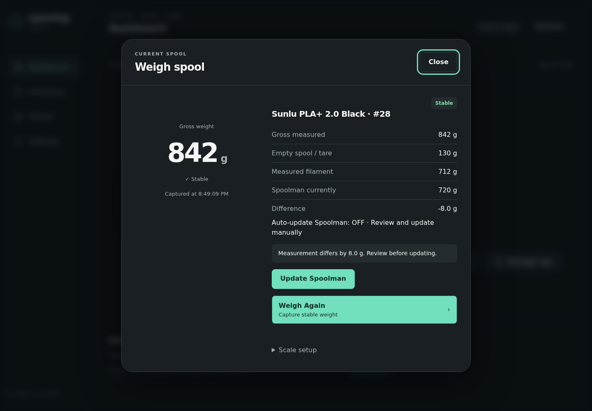

# Weigh a spool and save the weight

Weigh the spool on the station, compare the result with Spoolman, and save it if you want to.
Weighing on its own never changes Spoolman, and saving a weight never rewrites the tag.

## Before you start

- The scale is calibrated. See [Tare and calibrate](../scale/calibration.md).
- The tag is linked to a Spoolman spool. See [Write or update a tag](manage-tags.md).
- The spool has an initial weight in Spoolman, and its empty-spool weight is known
  (see [Where the empty-spool weight comes from](#where-the-empty-spool-weight-comes-from)).
- The whole spool rests on the platform. Nothing else touches it, and no filament end or cable
  pulls on it.

## Steps

### Touchscreen

1. Tap **WEIGH** on Home. The Weigh page opens and starts measuring.
   If you opened the page with **Weigh** in the bottom bar instead, tap **WEIGH** on that page.
   If the Home button reads **CALIBRATE**, the scale has no calibration yet.
2. Keep the spool still. The page shows the weight on the scale ("GROSS WEIGHT (g)") and a state:
   `MEASURING`, then `SETTLING`, then `STABLE`. The message reads "Measuring. Keep the spool still."
3. Read the result:

    | Line | Meaning |
    |---|---|
    | **Empty spool** | The weight of the empty reel. |
    | **Filament now** | What is on the scale minus the empty reel. |
    | **In Spoolman** | The remaining weight Spoolman has right now. |

    A value the station does not know is shown as "Not set".

4. The message tells you what saving will do, for example
   "Tap UPDATE SPOOLMAN to set its remaining weight to 712 g."
   Tap **UPDATE SPOOLMAN** to save. The message changes to "Saved to Spoolman."
5. To measure again instead, tap **WEIGH AGAIN**.

### Browser

1. On the Dashboard, click **Weigh**. The **Weigh spool** dialog opens and starts measuring.
2. Keep the spool still. The state goes from "Measuring…" to "Settling…" to "✓ Stable".
3. Read the result:

    | Row | Meaning |
    |---|---|
    | **Gross measured** | The weight on the scale. |
    | **Empty spool / tare** | The weight of the empty reel. |
    | **Measured filament** | What is on the scale minus the empty reel. |
    | **Spoolman currently** | The remaining weight Spoolman has right now. |
    | **Difference** | Measured filament compared with Spoolman. |

    A value the station does not know is shown as "—".

4. The message reads "Measured. Tap Update Spoolman to save it."
   Click **Update Spoolman** to save.
5. To measure again, click **Weigh Again** (the button reads **Retry** after a failed measurement).

*Demo data.*

## Good to know

- Each measurement can be saved once. To save again, weigh again.
- Leave the spool and its tag in place until the weight is saved.
  The station checks that the same tag is still on the reader before it writes to Spoolman.
- A measurement gives up after 20 seconds if the weight never settles.
- If the difference from Spoolman is within the tolerance (5 g by default), nothing is written
  and the message is "Spoolman already matches this weight. Nothing to update."
- A result up to 10 g above the spool's initial weight is saved as a full spool.
  Anything higher is refused.

## Save automatically

**Auto-update Spoolman after Weigh** saves every completed measurement without a second tap.
It is off by default.

- Touchscreen: **Settings**, then tap **Auto-update OFF** so it reads **Auto-update ON**.
  The change applies immediately.
- Browser: **Settings → Scale → Weight updates**, tick **Auto-update Spoolman after Weigh**,
  then click **Validate and save**.

With auto-update on, the message after measuring is "Measured. Saving to Spoolman..." and the browser
hides the **Update Spoolman** button. The browser dialog shows
"Auto-update Spoolman: ON · Captured Weigh only" or "Auto-update Spoolman: OFF · Review and update manually".

Auto-update only acts when you start a weigh yourself.
A spool left sitting on the station never changes Spoolman.

The tolerance is next to it in the browser: **Inventory matching tolerance (g)**.
There is no tolerance control on the touchscreen.

## Where the empty-spool weight comes from

The station subtracts the empty reel from the scale reading.
It uses the first of these that holds a weight above 0 g:

1. The spool in Spoolman (its empty-spool weight).
2. The filament in Spoolman.
3. The vendor (maker) in Spoolman.
4. The tag.

A value of 0 g counts as "not set" and is used only when none of the four holds a real weight.
A value in Spoolman always wins over the copy on the tag.
The tag's value is used only when the spool, its filament and its vendor have none.

## If something goes wrong

The message on the Weigh page (touchscreen) or in the Weigh spool dialog (browser) says why a weight
cannot be saved.

| What you see | What it means | What to do |
|---|---|---|
| "The weight did not settle. Keep the spool still and weigh again." | The reading kept moving. | Steady the spool, check nothing touches it, weigh again. |
| "Measurement failed or timed out. No inventory update" | No stable weight within 20 seconds, or the scale reported a fault. | Weigh again. If it repeats, see [Weight looks wrong](../troubleshooting/weight.md). |
| "The scale is busy. Try again in a moment." | Another scale action is still running. | Wait, then weigh again. |
| "This spool is not linked to Spoolman yet. Link the tag to a spool (Manage tag), then weigh again." | The tag is not linked to a spool. The same message appears when no tag is on the reader or Spoolman cannot be reached. | Link the tag ([Write or update a tag](manage-tags.md)), or check the tag and Spoolman, then weigh again. |
| "The empty spool weight is unknown. Set it on the spool in Spoolman, then weigh again." | Neither Spoolman (spool, filament, vendor) nor the tag holds an empty-spool weight. | Set the empty-spool weight on the spool in Spoolman. |
| "Spoolman has no remaining weight for this spool. Set its initial weight in Spoolman, then weigh again." | Spoolman cannot work out a remaining weight. | Set the spool's initial weight in Spoolman. |
| "The scale reads less than the empty spool weight. Check that the spool is on the scale and its empty weight is right." | The reading is lighter than an empty reel. | Seat the spool on the platform. Check the empty-spool weight in Spoolman. |
| "The weight tolerance setting is invalid. Check Settings." | The tolerance value is not usable. | Browser: **Settings → Scale → Weight updates**, fix **Inventory matching tolerance (g)**. |
| "Saving weights is turned off: this Spoolman version has not been tested with this firmware, or Spoolman is offline. See Settings." | Shown after you ask to save. Spoolman is unreachable or is a version the station does not save weights to. | See [Connect Spoolman](../inventory/spoolman.md#supported-spoolman-version). |
| "The spool on the station changed. Weigh again." | The tag was removed or swapped, or settings changed, after measuring. | Put the spool back and weigh again. |
| "Spoolman already matches this weight. Nothing to update." | The difference is within the tolerance. | Nothing. |
| "The measured filament (N g) is more than this spool's initial weight in Spoolman (M g). Check the empty spool weight, or correct the initial weight in Spoolman." | The result is more than 10 g above the initial weight. | Correct the empty-spool weight or the initial weight in Spoolman. |
| "This spool has no initial weight in Spoolman. Set its initial weight in Spoolman, then weigh again." | The spool has no initial weight. | Set it in Spoolman. |
| "Spoolman refused the new weight (HTTP 400). Check that the spool has an initial weight in Spoolman." | Spoolman rejected the value. | Set the spool's initial weight in Spoolman. |
| "Spoolman usage changed while this weight was being processed. No inventory value was overwritten. Weigh again" | Spoolman's used weight changed in the meantime, for example because a print used filament. | Weigh again. |

## Related

- [Tare and calibrate](../scale/calibration.md)
- [Weight looks wrong](../troubleshooting/weight.md)
