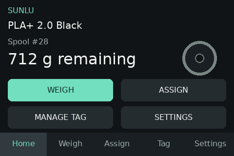

# What the station does and what you need

OpenTag Station is a small touchscreen device you build yourself.
You put a filament spool on it and it reads the spool's NFC tag, shows which Spoolman spool it is,
weighs it, and saves the remaining filament to Spoolman.
It also writes new tags from your Spoolman records and can tell a Prusa XL which spool is in which
toolhead.

*Demo data. The picture is a rendering of the touchscreen, not a photo.*

## What it does

- **Identifies a spool.** Place a tagged spool on the station and it looks the spool up in Spoolman.
- **Writes tags.** Pick a spool (or a filament) from Spoolman and the station writes a blank tag
  for it in the OpenPrintTag format, then checks the tag and links it to the spool in Spoolman.
- **Weighs and saves.** The station subtracts the empty spool weight and shows the filament that is
  left. Nothing is saved to Spoolman until you press **UPDATE SPOOLMAN** (or turn on automatic
  saving).
- **Clears tags for reuse.** Erase a tag, remove its link in Spoolman, and use it on another spool.
- **Assigns a spool to a toolhead** (optional). With FilaBridge and a Prusa XL, tell the printer
  which spool is loaded in T1–T5.

Spoolman stays the record of what you own. The station reads from it and updates it; it does not
keep its own inventory.

## What you need

| You need | Notes |
|---|---|
| The station hardware | A WT32-SC01 Plus touchscreen board, an NFC reader, a load cell with its amplifier, and a platform you build. See the [parts list](../hardware/bill-of-materials.md). |
| Spoolman | Your own running Spoolman server that the station can reach on your network. The station is not useful without it. |
| 2.4 GHz Wi-Fi | The station cannot join 5 GHz-only or WPA3-only networks. |
| Blank tags | NXP ICODE SLIX2 (NFC-V / ISO 15693). Other tag types are not seen at all. See [Which tags work](../openprinttag/supported-tags.md). |
| A desktop computer with Chrome or Edge | Only for installing the firmware over USB. Afterwards any browser on your network works. |
| A known weight | To calibrate the scale once. |
| FilaBridge and a Prusa XL | Optional. Only needed to assign spools to toolheads. |

## From parts to your first spool

Follow these pages in order:

1. [Parts list](../hardware/bill-of-materials.md) — buy the parts.
2. [Wiring](../hardware/wiring.md) — connect the scale and the NFC reader, then check
   [Power](../hardware/power.md) and build the [scale platform](../hardware/mechanical.md).
3. [Install the firmware over USB](../installation/web-flasher.md).
4. [First boot and Wi-Fi](first-boot.md) — get the station onto your network.
5. [Connect Spoolman and FilaBridge](initial-setup.md) — including the two
   [extra fields Spoolman needs](../inventory/custom-fields.md) and the
   [scale calibration](../scale/calibration.md).
6. [Your first spool](quick-start.md) — write a tag, save a weight, assign a toolhead.

## Two ways to use it

You can use the station from its **touchscreen** or from the **station's web page** in a browser on
the same network. Everyday work needs no browser: identifying, writing, clearing, weighing, saving
the weight and assigning a toolhead all work on the touchscreen.

The two use slightly different words. Most action buttons on the touchscreen are in capitals
(**WEIGH**, **MANAGE TAG**); browser buttons are not (**Weigh**, **Manage tag**). The touchscreen's start page
is **Home**; the browser's is **Dashboard**.

| Touchscreen pages | Browser pages |
|---|---|
| **Home**, **Weigh**, **Assign**, **Tag**, **Settings** | **Dashboard**, **Inventory**, **Printer**, **Settings** |

Some things exist in only one of them:

| Only on the touchscreen | Only in the browser |
|---|---|
| Showing the password of the setup network | Updating the firmware |
| Choosing the printer from a list of the printers FilaBridge found | Factory reset and restarting the station |
| Setting a new access token when you forgot the old one | Downloading and restoring a settings file |
| | Testing the Spoolman and FilaBridge connections (**Test**) |
| | Choosing the 5 kg or 2 kg load cell |
| | Editing spools and filaments in Spoolman |
| | Removing a spool from a toolhead (**Unassign**) |

The touchscreen never asks for the access token. The token only protects changes made through the
browser; see [Access token and network safety](../configuration/security.md).
