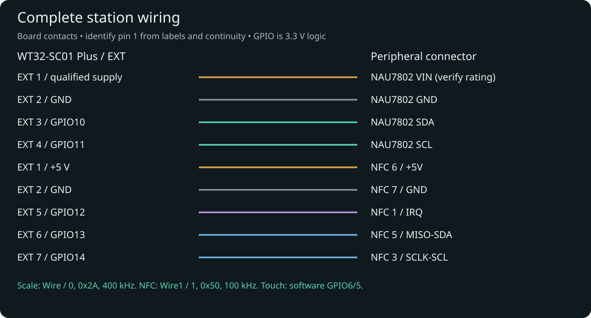
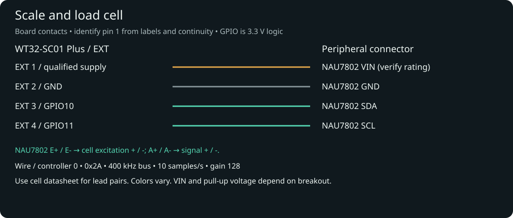
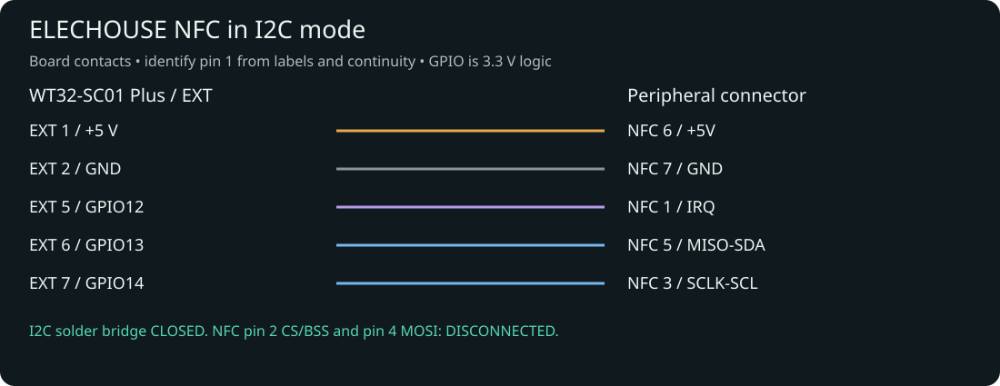

# Wiring

The scale and the NFC reader both plug into the 8-pin expansion connector (EXT) of the WT32-SC01 Plus.
The pins are fixed in the firmware; you cannot choose others.

## Before you start

- All parts from the [parts list](bill-of-materials.md).
- A multimeter with a continuity (beeper) setting.
- USB and every other power source **unplugged**.

!!! warning "Find pin 1 on the board, not on the cable"
    EXT pin 1 carries 5 V. The signal pins work at 3.3 V.
    A cable that is plugged in or read mirror-wise puts 5 V on a signal pin.
    Find pin 1 from the marking printed on the board, then check every wire with the multimeter
    from the board pin to the far end of the cable. Do not rely on wire colours.

The pin numbers below are board contacts, as numbered in the
[WT32-SC01 Plus datasheet](https://docs.makehub.tw/wt32-sc01plus/WT32-SC01%2BPLUS%2BDatasheet-V1.5%2BEN.pdf).
On the NFC module, pin 1 is IRQ and pin 7, at the other end, is GND.

## The EXT connector

| EXT pin | Label on board | GPIO | Goes to |
|---:|---|---|---|
| 1 | +5V | — | NFC module pin 6 (+5V). Also NAU7802 VIN, only if your breakout accepts 5 V. |
| 2 | GND | — | NFC module pin 7 (GND) and NAU7802 GND |
| 3 | EXT_IO1 | GPIO10 | NAU7802 SDA |
| 4 | EXT_IO2 | GPIO11 | NAU7802 SCL |
| 5 | EXT_IO3 | GPIO12 | NFC module pin 1 (IRQ) |
| 6 | EXT_IO4 | GPIO13 | NFC module pin 5 (MISO / SDA) |
| 7 | EXT_IO5 | GPIO14 | NFC module pin 3 (SCLK / SCL) |
| 8 | EXT_IO6 | GPIO21 | **DISCONNECTED** — the station does not use it |

The scale and the NFC reader each have their own pair of data wires. Do not join them.
The touchscreen uses pins inside the board; nothing on the EXT connector goes to it.

| Device | I2C address | Speed |
|---|---|---|
| NAU7802 (scale) | `0x2A` | 400 kHz |
| NFC reader | `0x50` | 100 kHz |

## Wire the scale

| NAU7802 terminal | Connects to |
|---|---|
| VIN (or VCC) | A supply your breakout accepts. EXT pin 1 (5 V) only if the breakout is rated for it. See [Power](power.md). |
| GND | EXT pin 2 |
| SDA | EXT pin 3 (GPIO10) |
| SCL | EXT pin 4 (GPIO11) |
| E+ | Load cell excitation + |
| E− | Load cell excitation − |
| A+ | Load cell signal + |
| A− | Load cell signal − |

1. Mount the load cell first. See [Scale platform and enclosure](mechanical.md).
2. Connect GND, SDA and SCL as in the table. Connect VIN according to your breakout's rating.
3. Connect the four load-cell wires to E+, E−, A+ and A−.
   The load cell is powered from the NAU7802 terminals, never directly from 5 V.
4. Use the load cell seller's wiring sheet to tell the four wires apart.
   Wire colours differ between sellers.
5. Fix the load-cell cable to the base, with a little slack at the cell,
   so it cannot pull on the platform.

## Wire the NFC reader

The station talks to the module over I2C, so the module must be in I2C mode:
**close the solder bridge marked I2C** on the module, as shown in the
[ELECHOUSE guide](https://www.elechouse.com/st25r3916-esp32-i2c-quick-start/).
With the bridge open the reader is not found.
Ignore the GPIO numbers in that guide; use the table below.

| NFC module pin | Connects to |
|---|---|
| 1 IRQ | EXT pin 5 (GPIO12) |
| 2 CS / BSS | **DISCONNECTED** |
| 3 SCLK / SCL | EXT pin 7 (GPIO14) |
| 4 MOSI | **DISCONNECTED** |
| 5 MISO / SDA | EXT pin 6 (GPIO13) |
| 6 +5V | EXT pin 1 (5 V) |
| 7 GND | EXT pin 2 (GND) |

1. Close the I2C solder bridge and check that the solder touches nothing else.
2. Connect the five wires in the table. The IRQ wire is required.
3. Insulate the two unused wires (pins 2 and 4) so they cannot touch anything.

The module has no reset or enable pin. Do not add extra wires.

## Pins that stay DISCONNECTED

- NFC module pin 2 (CS / BSS)
- NFC module pin 4 (MOSI)
- EXT pin 8 (GPIO21)

## Check before first power

- EXT pin 1 (5 V) goes only to NFC pin 6 and, if rated for it, NAU7802 VIN.
- No connection between 5 V and GND (multimeter shows no continuity).
- Every GND is connected to EXT pin 2.
- Scale wires are on GPIO10 and GPIO11; NFC wires are on GPIO13, GPIO14 and GPIO12.
- The I2C solder bridge on the NFC module is closed.
- NFC pins 2 and 4 are insulated and not connected.
- The platform moves freely and no cable pulls on it.

## Check after first power

Install the firmware first: [Install the firmware over USB](../installation/web-flasher.md).

1. **Touchscreen.** The screen shows the first-run setup. Tapping works.
2. **Scale.** On the touchscreen open **Settings → About / Advanced**.
   The **HARDWARE** block shows the scale state and two **ADC** numbers.
   Press lightly on the platform: the numbers change.
3. **NFC reader.** The reader starts only after the station is connected to Wi-Fi,
   so finish [First boot and Wi-Fi](../getting-started/first-boot.md) first.
   Then open **Settings → Wi-Fi & services** and tap **Next** until the step **NFC READER**.
   It shows `NFC reader ready. Place a tag on it to test.`
   Place a tag: `Blank tag found. The reader works.` or `OpenPrintTag found. The reader works.`
4. [Tare and calibrate](../scale/calibration.md) the scale.

If you connect a computer to the USB port and open a serial monitor at 115200 baud,
the station prints one of these lines about the scale while it starts:

| Serial output | Meaning |
|---|---|
| `NAU7802: PRESENT at 0x2A` | The scale converter is found. |
| `NAU7802: FOUND WITH SDA/SCL REVERSED` and `Check/swap SDA and SCL wiring` | SDA and SCL are swapped. Swap the two wires; the station does not adapt to it. |
| `NAU7802 0x2A not present` | Something answers on GPIO10/GPIO11, but not the scale converter. Check that these wires go to the NAU7802. |
| `NAU7802: NOT DETECTED` and `Check NAU7802 power, harness, connector orientation, SDA/SCL wiring, or module` | Nothing answers on GPIO10/GPIO11. Check power and all four wires. |

## If something goes wrong

| What you see | What it means | What to do |
|---|---|---|
| In the **NFC READER** setup step: `NFC reader problem. Check the NFC wiring.` | The reader does not answer at `0x50`, or reading the tag on it failed. | Remove the tag. If the message stays, check 5 V and GND at the module, the I2C solder bridge, and the wires to GPIO13, GPIO14 and GPIO12. |
| In the **NFC READER** setup step: `NFC reader starting...` and it stays | The station is not connected to Wi-Fi yet. | Connect Wi-Fi. See [Tag is not detected](../troubleshooting/tag.md). |
| Reader is ready but no tag is found | Wrong tag type, or metal near the antenna. | See [Tag is not detected](../troubleshooting/tag.md). |
| ADC numbers never change | A load-cell wire is open or the pairs are mixed up. | Check all four cell wires against the cell's wiring sheet. |
| Weight goes down when you add load | The wiring or the cell direction changed after the last calibration. | Calibrate again. Calibration works with the cell in either direction. |
| Weight drifts or jumps | The platform touches something or a cable pulls on it. | See [Weight looks wrong](../troubleshooting/weight.md). |

## For the curious: pins inside the board

You do not wire these. They are listed so you know which GPIOs are taken.

| Built-in part | Pins |
|---|---|
| Touch | SDA GPIO6, SCL GPIO5, interrupt GPIO7, address `0x38` |
| Display data D0–D7 | GPIO 9, 46, 3, 8, 18, 17, 16, 15 |
| Display control | write GPIO47, command GPIO0, reset GPIO4, backlight GPIO45 |

The pin numbers on this page come from the firmware's board definition
[`wt32_sc01_plus_rev_a.hpp`](https://github.com/76cb/OpenTag-Station/blob/main/src/boards/wt32_sc01_plus_rev_a.hpp)
and the scale driver
[`nau7802_device.hpp`](https://github.com/76cb/OpenTag-Station/blob/main/src/hardware/scale/nau7802_device.hpp).
